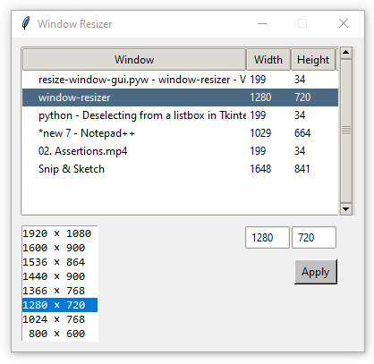

# window-resizer

Resize a window to specific dimensions.

## CLI

## GUI

## Roadmap
- [x] Simple CLI. (2022-02-01)
- [x] Switch to GUI; list windows along with their current position and size. (2022-02-02)
    - [x] Auto refresh every second. (2022-02-08)
- [x] Add inputs for size (and a button to apply). (2022-02-03/04)
- [ ] Add common sizes for size inputs.